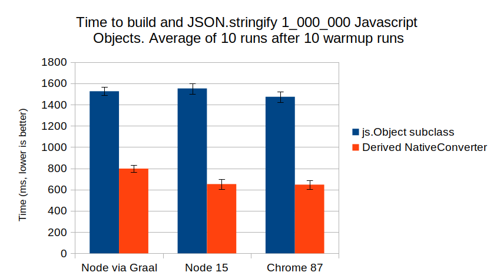

A [Scala.js](https://www.scala-js.org/) project that makes it easy to convert to and from native JavaScript.

```Scala
import scala.scalajs.js.JSON
import org.getshaka.nativeconverter.NativeConverter

case class User(name: String, isAdmin: Boolean, age: Int) derives NativeConverter

// to JSON
val u = User("John Smith", true, 42)
val json = JSON.stringify(u.toNative)

// from JSON
val parsedUser = NativeConverter[User].fromNative(JSON.parse(json))
```

The primary motivation is using case classes with the [JSON](https://developer.mozilla.org/en-US/docs/Web/JavaScript/Reference/Global_Objects/JSON) object, although any use-case is supported.

## Installing
This library requires Scala 3 (Dotty), which is in release candidate. After [setting up a Scala.js project with SBT](https://www.scala-js.org/doc/tutorial/basic/),

In `/project/plugins.sbt` add the latest sbt-dotty and Scala.js plugin:
```Scala
addSbtPlugin("ch.epfl.lamp" % "sbt-dotty" % "0.5.3")
addSbtPlugin("org.scala-js" % "sbt-scalajs" % "1.5.0")
```

Then in `/build.sbt`, set the scala version and add the native-converter dependency:

```Scala
scalaVersion := "3.0.0-RC1",

libraryDependencies ++= Seq(
  "org.getshaka" %%% "native-converter" % "0.4.0"
)

// these features are optional
// but are nice and will probably be in Scala 3
scalacOptions ++= Seq(
  // https://dotty.epfl.ch/docs/reference/other-new-features/indentation.html#variant-indentation-marker-
  "-Yindent-colons",
  // https://dotty.epfl.ch/docs/reference/other-new-features/safe-initialization.html
  "-Ycheck-init",
)
```

## Documentation

The contract of the NativeConverter Typeclass is as follows:

```Scala
/**
 * Typeclass for converting between Scala.js and native JavaScript.
 * @tparam T the type to convert
 */
trait NativeConverter[T]:
  /**
   * Convert a Scala.js type to native JavaScript.
   * <br>
   * This is an extension method, so it's available on all types
   * that `derive NativeConverter`. To use for other types, like Int, summon
   * a NativeConverter and use: `NativeConverter[Int].toNative(123)`
   * <br>
   * Any RuntimeException subclass may be thrown if conversion fails.
   */
  extension (t: T) def toNative: js.Any

  /**
   * Convert a native Javascript type to Scala.js.
   * <br>
   * Any RuntimeException subclass may be thrown if conversion fails.
   */
  def fromNative(nativeJs: js.Any): T
```

A Typeclass is just a generic class whose instances operate on some type. Typeclasses let you add features to types you don't control, aka [Retroactive Polymorphism](https://august.nagro.us/retroactive-polymorphism-scala.html).

In Java, defining, creating, and passing Typeclass instances around would be inconvenient, so people use slow reflection instead. But Scala 3 makes it easy. When you write `case class User(..) derives NativeConverter`, the scala compiler calls method `NativeConverter::derived`, which generates a `given` instance in User's companion object. When you summon a NativeConverter for User, either with `summon[NativeConverter[User]]` or just `NativeConverter[User]` via the 0-arg `apply` helper, the same instance is returned.

You can summon built-in NativeConverters for all the primitive types:

```Scala
val i: Int = NativeConverter[Int].fromNative(JSON.parse("100"))

val nativeByte: js.Any = NativeConverter[Byte].toNative(127.toByte)

val s: String = NativeConverter[String]
  .fromNative(JSON.parse(""" "hello world" """))
```

Char and Long are always converted to String, since they cannot be represented directly in JavaScript:

```Scala
// native String
val nativeLong = NativeConverter[Long].toNative(Long.MaxValue)

val parsedLong = NativeConverter[Long]
  .fromNative(JSON.parse(s""" "${Long.MaxValue}" """))

```

If you want to change this behavior for Long, implement a `given` instance of NativeConverter[Long]. The example below uses String for conversion only when the Long is bigger than Int.

```Scala
given NativeConverter[Long] with

  extension (t: Long) def toNative: js.Any =
    if t > Int.MaxValue || t < Int.MinValue then t.toString
    else t.toInt.asInstanceOf[js.Any]

  def fromNative(nativeJs: js.Any): Long =
    try nativeJs.asInstanceOf[Int]
    catch case _ => nativeJs.asInstanceOf[String].toLong

// "123"
val smallLong: String = JSON.stringify(NativeConverter[Long].toNative(123L))

// """ "9223372036854775807" """.trim
val bigLong: String = JSON.stringify(NativeConverter[Long].toNative(Long.MaxValue))
```

Functions can be converted between Scala.js and Native:

```Scala
val helloWorld = (name: String) => "hello, " + name

val nativeFunc = NativeConverter[String => String].toNative(helloWorld)

// returns "hello, Ray"
nativeFunc.asInstanceOf[js.Dynamic]("Ray")
```

Arrays, Iterables, Seqs, Sets, Lists, and Buffers are serialized using JavaScript Arrays:

```Scala
// default NativeConverters are only implemented
// for the collections in scala.collection.*, not the deprecated
// aliases in scala.Predef
import scala.collection.{Seq, Set}

val seq = Seq(1, 2, 3)
val set = Set(1, 2, 3)

// "[1,2,3]"
val seqJson = JSON.stringify(NativeConverter[Seq[Int]].toNative(seq))

// "[1,2,3]"
val setJson = JSON.stringify(NativeConverter[Set[Int]].toNative(set))
```

Maps become JavaScript objects:

```Scala
import scala.collection.Map
import scala.collection.mutable.HashMap

val map = HashMap("a" -> 1, "b" -> 2)

// """ {"a":1,"b":2} """.trim
val mapJson = JSON.stringify(NativeConverter[Map[String, Int]].toNative(map))
```

Only String keys are supported, since JSON requires String keys. If you'd rather convert to an [ES 2016 Map](https://www.scala-js.org/api/scalajs-library/latest/scala/scalajs/js/Map.html), do the following:

```Scala
import org.getshaka.nativeconverter.EsConverters.given

val map = HashMap(1 -> 2, 3 -> 4)

val nativeMap = NativeConverter[Map[Int, Int]].toNative(map)

// returns 4
nativeMap.asInstanceOf[js.Dynamic].get(3)
```

Converters are not yet implemented for many native ES types, please file an issue or PR if we're missing one you'd like.

Option is serialized with null if None, and the converted value if Some.
```Scala
val nc = NativeConverter[Option[Array[Int]]]
val some = Some(Array(1,2,3))

// "[1,2,3]"
val someJson = JSON.stringify(nc.toNative(some))

// None
val none = nc.fromNative(JSON.parse("null"))
```

Any [Product](https://www.scala-lang.org/api/current/scala/Product.html) or Sum type can derive a NativeConverter. Product types are serialized into objects with the parameter names as keys. Simple Sum types (ie, non-parameterized [enums](https://dotty.epfl.ch/docs/reference/enums/enums.html) and sealed hierarchies) are serialized using their (short) type name. Other Sum types are serialized and deserialized using a `@type` property that equals the (short) type name.

This behavior closely matches [Jackson](https://github.com/FasterXML/jackson) and other popular libraries, in order to maximize compatibility.

You can for example redefine Option as a Scala 3 enum:

```Scala
enum Opt[+T] derives NativeConverter:
  case Sm(x: T)
  case Nn

// """ {"@type":"Nn"} """.trim
val nnJson = JSON.stringify(Opt.Nn.toNative)

// Opt.Sm(123L)
val sm = NativeConverter[Opt[Long]].fromNative(JSON.parse(""" {"x":123,"@type":"Sm"} """))
```

And of course, you can nest to any depth you wish:

```Scala
// recommended but not required for X to derive NativeConverter
case class X(a: List[String]) 
case class Y(b: Option[X]) derives NativeConverter

val y = Y(Some(X(List())))
val yStr = """ {"b":{"a":[]}} """.trim.nn

assertEquals(yStr, JSON.stringify(y.toNative))

assertEquals(y, NativeConverter[Y].fromNative(JSON.parse(yStr)))
```

If [Cross Building](https://www.scala-js.org/doc/project/cross-build.html) your Scala project you can use one language for both frontend and backend development. Sub-project `/jvm` will have your JVM sources, `/js` your JavaScript, and in `/shared` you can define all of your validations and request/response DTOs once. In the `/shared` project you do not want to depend on `NativeConverter`, since that would introduce a dependency on Scala.js in your `/jvm` project. So instead of writing `derives NativeConverter` on your case classes, create an object in `/client` that holds the derived converters:

```Scala
// in shared project
case class User(name: String, isAdmin: Boolean, age: Int)

// in js project
object DtoConverters:
  given NativeConverter[User] = NativeConverter.derived
  
object App:
  import DtoConverters.given

  @main def launchApp: Unit =
    println(JSON.stringify(User("John", false, 21).toNative))
```

Here is a sample cross-project you can clone: [https://github.com/AugustNagro/native-converter-crossproject](https://github.com/AugustNagro/native-converter-crossproject)

But what about performance, surely making your own js.Object subclasses is faster?
Nope, derived NativeDecoders are 2x faster, even for simple cases like `User("John Smith", true, 42)`:



The generated JavaScript code is very clean. This is all possible because of Scala 3's [`inline`](https://dotty.epfl.ch/docs/reference/metaprogramming/inline.html) keyword, and powerful type-level programming capabilities. That's right.. no Macros used whatsoever! The `derives` keyword on type T causes the NativeConverter Typeclass to be auto-generated in T's companion object. Only once, and when first requested.

It is safe to say that Scala 3 is very impressive. And a big thank you to Sébastien Doeraene and Tobias Schlatter, who are first-rate maintainers of Scala.js, as well as Jamie Thompson who provided advice on the conversion of Sum types.

## License
https://www.apache.org/licenses/LICENSE-2.0